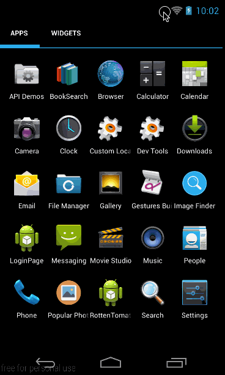

# Week 2 Project : Grid Image Search

Build a Google Image Search app which allows a user to select search filters and paginate results infinitely. Some main resources used are:

* [Google Search API](https://developers.google.com/image-search/v1/jsondevguide#json_reference)
* [Parcelable](https://github.com/mcharmas/android-parcelable-intellij-plugin) -- using Intellij plugin

## User story completed ##

* __Required__ User can enter search query and image results are shown on grid view
* __Required__ User can click on 'settings' to show filter options, and allow user to configure size, 
color filter, type and site. 
* __Required__ Subsequent search still use the same filter
* __Required__ User can tap on image to show image in full screen
* __Required__ User can scroll down indefinetely

* __Optional__ Using actionbar search view
* __Optional__ user can share an image
* __Optional__ Filter settings are shown in modal overlay
* __Optional__ user can zoom or pan images
* __Optional__ check for internet availability, experiment with styling and coloring (navbar).

